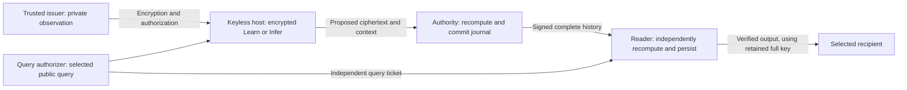

# Executable encrypted adaptation with independently verified release

[EXECUTED, 2026-09-07] The complete fixed utility workload passes through
actual BFV, a durable mixed journal and an independently verifying reader:
**384 Learn, 96 Infer, 256 exact-original expiries, and 96 matching integer
outputs**. This local research demonstration retains a trusted full-key reader.
The keyless host and authority receive ciphertexts and public query metadata.
It does not achieve the absence of every unrestricted read credential.



[DERIVED] Authority finalization and reader verification are distinct steps.
The reader begins at its own pinned genesis, validates every accepted input and
parent, recomputes the encrypted transition and checks the selected output.
Publication waits until verification succeeds. Exact retry then delivers
the stored result without another state transition or another decryption.
This is public recomputation, not a succinct proof or a Python-to-Lean refinement.

## Run and inspect the demonstration

[EXECUTED reproduction] From this repository on the recorded workspace, with
the frozen input materialization and crypto binary already present:

```sh
python3 research/learn_infer_only/experiments/end_to_end/verified_reader/utility_driver.py \
  --runtime research/learn_infer_only/experiments/end_to_end/verified_reader/runtime/my_utility_run \
  --reports research/learn_infer_only/experiments/end_to_end/verified_reader/reports/my_utility_run
```

[DERIVED prerequisites] Choose unused paths and keep runtime under the ignored
directory. Build instructions and the read-only local Rust dependency are in
[crypto/README.md](crypto/README.md). Materialize the fixed inputs with
`python3 research/learn_infer_only/experiments/end_to_end/utility/materialize_inputs.py`.
Python, the recorded cryptography package, cached data and local companion
dependencies are prerequisites; this is not a portable installer.

[EXECUTED evidence] [UTILITY.md](verified_reader/reports/UTILITY.md) records the
successful command, source/binary/fixture pins, complete command logs and
independent integer validation. All 480 finalizations agree with the reader's
ordered journal and state. Exactly 96 decryptions occur at the verifier, and
zero occur at the replaced baseline receiver. Sixteen answers are known
empty-state zeros; 80 use nonempty encrypted state.

## Results and assumptions

| Evidence | Result and boundary |
|---|---|
| [EXECUTED] Fixed useful workload | 52/96 correct over all checkpoints, 44/80 nonempty, 18/32 final. Encryption and verification preserve the original subset's successes and failures. |
| [EXECUTED] Fresh private synthetic inputs | Separate verified run004: 40 Learn, four Infer, eight expiries, exact outputs, restart and 23 refusal controls. Inputs are unknown to host/authority process arguments; the issuer/oracle retains them. No utility estimate follows. |
| [EXECUTED] Actual text ingress | The independently verified live-text path runs the local model at the issuer, encrypts its vector, learns and returns two authorized answers. Both compare correctly and the answer changes after learning; zero baseline decryptions. Whole-path time 15.418 seconds. One illustrative input is not an accuracy estimate. |
| [EXECUTED] Integrity and continuity | Exact original expiry, parent/genesis/recipient/query binding, strict canonical signed contexts and durable retries have recorded checks. The verifier's own retained persistence remains trusted. |
| [EXECUTED] Complete workload cost | 682.666 seconds on the shared machine, including journal and reader verification; cached features exclude model encoding. Current two-route state references 66 ciphertexts, 5,616,798 bytes; verifier CAS retains 34,663,205 bytes per history. |
| [DERIVED] Confidentiality | Conditional on encryption security, compatible allowed outputs, honest issuance and the trusted reader. Encrypting a public fixture does not create an unknown lifetime. |

[EXECUTED] The [optimized complete workload](verified_reader/reports/FAST_UTILITY.md)
also passes all 480 events and 96 independent integer comparisons in 201.345
seconds. That is an observed 3.39x improvement across separate shared-machine
runs, preserving authority/reader checks and full-byte hashing. The earlier
682.666-second result remains the unoptimized baseline.

[EXECUTED] The [host worker experiment](host_runtime/README.md) separately
reduces paired host time from 21.782 seconds to 3.042 seconds including startup
for an identical 44-event workload. It preserves 2,026 full-byte hash checks and
all exact proposals. That is paired host-only evidence, a different measurement
from the complete workload above.

[DERIVED trust boundary] The issuer knows observations and asserts their hidden
feature/range/key provenance. The query policy selects permitted disclosures.
The reader holds the full BFV secret and can decrypt state if compromised.
Separate processes and private files on one account do not isolate these roles
from the machine's operator. Classical Ed25519 authentication and unproved
implementation/security interfaces prevent an end-to-end PQ claim.

[DERIVED next construction] The separate finite quotient and fixed-span FE
experiments test narrower ways to retain permitted computation after removing
the original master credential. They cannot be inserted here by renaming the
reader. Their functionality, future queries, setup erasure and recipient/
continuity behavior must compose with this actual learner.

[SOURCE / scope] [CONTRACT.md](CONTRACT.md) retains the original acceptance
contract. [PRIVACY_SCOPE.md](PRIVACY_SCOPE.md) is the reviewed honest-authority
argument; the stronger [verifying-reader argument](verified_reader/PRIVACY_ARGUMENT.md)
passed [independent review and closeout](../adversarial_review/verified_reader_privacy/CLOSEOUT.md)
under its explicit issuance/primitive/reader assumptions. The 708-pin combined proposal remains separately checked
mathematical models, not a universal correctness proof of this implementation.
