# Complete saved ciphertext square

[EXECUTED] The complete saved degree-8192 ciphertext square passed the fresh
joined verifier: all four extension proofs, eighteen tensor proofs and six
reused rescale proofs, covering every component and prime. Total proof size is
69,269,567 bytes. The new phases took 107.341 seconds of proving; fresh joined
verification took 11.225 seconds including public reconstruction (3.557 seconds
inside the proof verifier). Peak new-prover RSS was 8,225,964,032 bytes. No
rescale proof was regenerated, and no private key was read.

`RESULT.json` and `results/whole_verify001/result.json` are the completed
primitive's acceptance records. Encoding/NTT parsing, exact phase binding and
the proof backend remain explicit TCB. There is no whole-Lean refinement claim.

[OPEN ongoing outcome] This square is now a frozen component of one complete
`Infer(committed_model, query) → verified kernel ciphertext` construction.
The same saved workload's packed dot/reduction and evaluation-key switching
remain to be joined; a complete nonlinear Infer is not yet claimed.

```mermaid
flowchart LR
  A[Raw two-component input] -->|public inverse NTT| B[Base PowerBasis]
  B -->|4 generated extension proofs| C[Extended PowerBasis]
  C -->|public NTT| D[Extended NTT]
  D -->|18 generated tensor proofs| E[Product NTT]
  E -->|public inverse NTT binding| F[Captured product PowerBasis]
  F -->|6 reused rescale proofs| G[Output PowerBasis]
  G -->|public NTT and serialization| H[Raw three-component output]
```



[EXECUTED] The native exporter builds all 16,384 extension positions and
73,728 tensor tuples. Its native public tensor computation and inverse
transforms match every saved pre-rescale residue. Import took 0.529 seconds;
it did not recompute rescale or read a private key. Exact constructor constants,
complete public rows and operation binding are in `results/case001/`.

The reusable entrypoint is:

```sh
python3 run.py CASE EXISTING_RESCALE_PROOFS NEW_RUN
```

It produces the two new phases, then freshly verifies all proofs together.
The native `import PUBLIC_SOURCE NEW_CASE` command constructs a case from the
saved public capture. The approved `extension.json`, `tensor.json` and
`rescale.json` configurations must be present before execution.

Proof-only consumers can invoke:

```sh
python3 verify_whole.py CASE EXTENSION_PROOFS TENSOR_PROOFS RESCALE_PROOFS NEW_OUT
```

No witness or private key is needed. The consumer selects its own approved
templates and performs complete fixed interval coverage. It reconstructs
public linear transform boundaries; extension/product/scaler correctness is
decided by generated relation proofs. Parser, transforms, proof backend and
binding controller remain explicit TCB, not claimed Lean refinements.

`CONTRACT.md` gives the exact scope and layouts. `BUILD.json` pins the isolated
native runtime and unchanged shared backend. Earlier companion sources,
captured ciphertexts and completed rescale outputs remain untouched.
